# PlanBe Backend — Plan, requisitos y modelo UML

> Generado a partir de `ideesBack.md`. Referencia: https://qquedada.es/


## 1. Visión
PlanBe: plataforma para crear, descubrir y unirse a quedadas (planes) entre personas y grupos. Backend REST (HAL) con Spring Data REST.

## 2. Actores
- **Anónimo**: se registra, ve quedadas públicas.
- **Usuario**: gestiona su perfil, crea quedadas, se apunta, invita, comenta, valora.
- **Miembro / Admin de grupo**: gestiona el grupo y sus quedadas.
- **Admin de plataforma** (`ROLE_ADMIN`): modera (catálogo de intereses, reportes, bloqueos).

## 3. Requisitos funcionales (prioridad MoSCoW)

**RF-1 Autenticación** (Must) — ya existe en la plantilla
- RF-1.1 Registro (username, email, password ≥8) → `RegisterUser.feature`.
- RF-1.2 Login (Basic auth, `/identity`).
- RF-1.3 Cambio de contraseña (Should).

**RF-2 Perfil de usuario** (Must)
- RF-2.1 Campos: `displayName`, `birthDate` (edad derivada), `gender` (enum, opcional), `bio`, `avatarUrl`, `city`.
- RF-2.2 Intereses: N:M con `Interest` (catálogo gestionado por ADMIN).
- RF-2.3 Solo el propio usuario (o ADMIN) edita su perfil.
- RF-2.4 Edad mínima validada en perfil.
- RF-2.5 Privacidad: `birthDate` y `gender` no visibles a otros salvo `showPersonalData = true`.

**RF-3 Quedadas (`Meetup`)** (Must)
- RF-3.1 CRUD: `title`, `description`, `category`, `startDate`, `endDate`, `capacity` (aforo), `visibility` (PUBLIC/PRIVATE/GROUP), `status` (DRAFT/OPEN/FULL/CANCELLED/FINISHED), `location`.
- RF-3.2 Solo organizador (o admin del grupo / ADMIN) edita o borra.
- RF-3.3 Validaciones: `startDate` futura, `endDate > startDate`, `capacity ≥ 1`.
- RF-3.4 Visibilidad: PUBLIC → todos; PRIVATE → organizador + invitados/participantes; GROUP → miembros del grupo.
- RF-3.5 Búsqueda: por categoría, fecha, ciudad, interés (`/meetups/search/...`).
- RF-3.6 Restricciones de público (Could): `minAge`, `maxAge`, `targetGender` opcional; se valida al unirse.
- RF-3.7 Precio por persona (Could): `price` opcional (`BigDecimal ≥ 0`, null = gratis).
- RF-3.8 Quedadas recurrentes (Could): `recurrence` (NONE/WEEKLY/BIWEEKLY/MONTHLY) + `recurrenceEnd`; al finalizar una ocurrencia se genera la siguiente.

**RF-4 Participación e invitaciones** (Must)
- RF-4.1 Unirse a una quedada visible (`Participation`), respetando aforo y restricciones RF-3.6.
- RF-4.2 Lista de espera (Should): si está llena, `Participation.status = WAITING`; al liberarse plaza, el primero en espera pasa a CONFIRMED.
- RF-4.3 Invitaciones (`Invitation` PENDING/ACCEPTED/DECLINED); aceptar crea `Participation`.
- RF-4.4 Abandonar una quedada.
- RF-4.5 Al cancelar una quedada, las participaciones pasan a CANCELLED.

**RF-5 Organizaciones / grupos** (Should)
- RF-5.1 CRUD de `Group` (`name`, `description`, `visibility`, `avatarUrl`).
- RF-5.2 `Membership` con rol OWNER / ADMIN / MEMBER.
- RF-5.3 Solicitar unirse / invitar al grupo (`Membership.status` PENDING/ACTIVE).
- RF-5.4 Quedadas asociadas a un grupo (visibilidad GROUP).

**RF-6 Ubicación** (Must) — `Location` `@Embeddable`: `name`, `address`, `city`, `latitude`, `longitude`.

**RF-7 Comentarios** (Should)
- `Comment` en una quedada; solo quien puede ver la quedada comenta; autor o ADMIN borra.

**RF-8 Valoraciones** (Could)
- `Review` (1–5 ★ + texto) solo por participantes CONFIRMED y solo si la quedada está FINISHED; una por usuario y quedada.
- Media de valoraciones del organizador visible en su perfil.

**RF-9 Recomendaciones** (Could)
- `/meetups/search/recommended`: quedadas PUBLIC OPEN cuya categoría/intereses coinciden con los del usuario, en su ciudad.

**RF-10 Notificaciones** (Could)
- `Notification` (tipo, mensaje, `read`, enlace a la entidad) creada por los handlers: invitación recibida, quedada cancelada/modificada, plaza liberada en lista de espera, solicitud de grupo.
- Cada usuario solo ve y marca como leídas las suyas.

**RF-11 Moderación** (Could)
- `Block`: un usuario bloquea a otro → no puede invitarle ni verle en sus quedadas.
- `Report`: reportar usuario/quedada/comentario con motivo; estado OPEN/RESOLVED/DISMISSED gestionado por ADMIN.

**RF-12 Chat de quedada** (Won't en v1, planificado)
- `ChatMessage` por quedada, solo participantes. v1: polling vía REST paginado (`/chatMessages/search/findByMeetup`). v2: WebSocket/STOMP (requiere salir del patrón puro Spring Data REST).

## 4. Requisitos no funcionales
- RNF-1 Sin controllers manuales; `@RepositoryRestResource` + `@RepositoryEventHandler` (ver `AGENTS.md`).
- RNF-2 Autorización por fila con SpEL en `@Query` (patrón `RecordRepository.OWNERSHIP_CLAUSE`); BCrypt.
- RNF-3 Bean Validation → 400 con mensaje (`RestValidationConfig`).
- RNF-4 Paginación en todas las colecciones.
- RNF-5 Auditoría `created`/`modified` como en `Record`.
- RNF-6 Cada requisito Must/Should cubierto por un `.feature` que pase con `mvn test -Dtest=CucumberTest`.
- RNF-7 RGPD: datos personales opcionales y ocultos por defecto (RF-2.5).

## 5. Modelo de dominio (UML, Mermaid)

```mermaid
classDiagram
    class UriEntity~ID~ {
        <<abstract>>
        -String uri
        -Long version
    }
    class User {
        String id
        String email
        String password
        String displayName
        LocalDate birthDate
        Gender gender
        boolean showPersonalData
        String bio
        String avatarUrl
        String city
        +getAge() int
    }
    class Interest {
        Long id
        String name
    }
    class Meetup {
        Long id
        String title
        String description
        Category category
        Instant startDate
        Instant endDate
        Integer capacity
        Visibility visibility
        MeetupStatus status
        Location location
        Integer minAge
        Integer maxAge
        Gender targetGender
        BigDecimal price
        Recurrence recurrence
        LocalDate recurrenceEnd
        Instant created
        Instant modified
        +isFull() boolean
    }
    class Location {
        <<embeddable>>
        String name
        String address
        String city
        Double latitude
        Double longitude
    }
    class Participation {
        Long id
        ParticipationStatus status
        Instant joinedAt
    }
    class Invitation {
        Long id
        InvitationStatus status
        Instant sentAt
    }
    class Group {
        Long id
        String name
        String description
        Visibility visibility
        String avatarUrl
    }
    class Membership {
        Long id
        GroupRole role
        MembershipStatus status
        Instant joinedAt
    }
    class Comment {
        Long id
        String text
        Instant created
    }
    class Review {
        Long id
        int rating
        String text
        Instant created
    }
    class Notification {
        Long id
        NotificationType type
        String message
        String targetUri
        boolean read
        Instant created
    }
    class Block {
        Long id
        Instant created
    }
    class Report {
        Long id
        String reason
        String targetUri
        ReportStatus status
        Instant created
    }
    class ChatMessage {
        Long id
        String text
        Instant sentAt
    }

    class Gender { <<enum>> MALE FEMALE NON_BINARY UNDISCLOSED }
    class Category { <<enum>> SPORT CULTURE FOOD TRAVEL GAMES STUDY OTHER }
    class Visibility { <<enum>> PUBLIC PRIVATE GROUP }
    class MeetupStatus { <<enum>> DRAFT OPEN FULL CANCELLED FINISHED }
    class Recurrence { <<enum>> NONE WEEKLY BIWEEKLY MONTHLY }
    class ParticipationStatus { <<enum>> CONFIRMED WAITING CANCELLED }
    class InvitationStatus { <<enum>> PENDING ACCEPTED DECLINED }
    class GroupRole { <<enum>> OWNER ADMIN MEMBER }
    class MembershipStatus { <<enum>> PENDING ACTIVE }
    class NotificationType { <<enum>> INVITATION MEETUP_CANCELLED MEETUP_UPDATED SPOT_FREED GROUP_REQUEST }
    class ReportStatus { <<enum>> OPEN RESOLVED DISMISSED }

    UriEntity <|-- User
    UriEntity <|-- Meetup
    UriEntity <|-- Interest
    UriEntity <|-- Participation
    UriEntity <|-- Invitation
    UriEntity <|-- Group
    UriEntity <|-- Membership
    UriEntity <|-- Comment
    UriEntity <|-- Review
    UriEntity <|-- Notification
    UriEntity <|-- Block
    UriEntity <|-- Report
    UriEntity <|-- ChatMessage

    User "*" -- "*" Interest : interests
    Meetup "*" -- "*" Interest : tags
    Meetup *-- Location
    Meetup "*" --> "1" User : organizer
    Meetup "*" --> "0..1" Group : group
    Meetup "0..1" --> "0..1" Meetup : previousOccurrence
    Participation "*" --> "1" User : participant
    Participation "*" --> "1" Meetup : meetup
    Invitation "*" --> "1" User : invitee
    Invitation "*" --> "1" User : invitedBy
    Invitation "*" --> "1" Meetup : meetup
    Membership "*" --> "1" User : member
    Membership "*" --> "1" Group : group
    Comment "*" --> "1" User : author
    Comment "*" --> "1" Meetup : meetup
    Review "*" --> "1" User : author
    Review "*" --> "1" Meetup : meetup
    Notification "*" --> "1" User : recipient
    Block "*" --> "1" User : blocker
    Block "*" --> "1" User : blocked
    Report "*" --> "1" User : reporter
    ChatMessage "*" --> "1" User : sender
    ChatMessage "*" --> "1" Meetup : meetup
```



Notas de diseño:
- `Participation` y `Membership` son entidades de asociación (no `@ManyToMany`) porque llevan atributos y necesitan endpoint y autorización propios.
- `Meetup.organizer` sustituye a `Record.ownedBy`; `Record` se elimina cuando `Meetup` esté verde.
- `Report.targetUri` / `Notification.targetUri` referencian cualquier entidad por su URI (`UriEntity.getUri()`), evitando herencia polimórfica.
- `User` mantiene `String id` (username) como en la plantilla.

## 6. Endpoints (Spring Data REST, generados)
`/users`, `/interests`, `/meetups` (+ `search/findByCategory`, `findByLocationCity`, `findByStartDateAfter`, `findByOrganizer`, `recommended`), `/participations`, `/invitations`, `/groups`, `/memberships`, `/comments`, `/reviews`, `/notifications`, `/blocks`, `/reports`, `/chatMessages`.

## 7. Roadmap por iteraciones SDD
Cada iteración: `.feature` → StepDefs → entidad + repositorio → handler → `mvn test -Dtest=CucumberTest` (skills en `skills/`).

| It. | Feature file | Artefactos |
|---|---|---|
| 0 | `RegisterUser.feature` (existe) | — |
| 1 | `ManageProfile.feature` | campos en `User`, `UserEventHandler`, `Interest` |
| 2 | `ManageMeetup.feature` | `Meetup`, `Location`, `MeetupRepository` (SpEL visibilidad), `MeetupEventHandler` |
| 3 | `JoinMeetup.feature` | `Participation`, aforo, lista de espera, restricciones edad/género |
| 4 | `InviteToMeetup.feature` | `Invitation` → `Participation` |
| 5 | `ManageGroup.feature` | `Group`, `Membership`, quedadas GROUP |
| 6 | `CommentMeetup.feature` | `Comment` |
| 7 | `ReviewMeetup.feature` | `Review`, media del organizador |
| 8 | `Notifications.feature` | `Notification` creada desde handlers existentes |
| 9 | `RecommendMeetups.feature` | query `recommended` por intereses + ciudad |
| 10 | `Moderation.feature` | `Block`, `Report` |
| 11 | `RecurringMeetup.feature` | `recurrence`, generación de siguiente ocurrencia |
| 12 | `MeetupChat.feature` | `ChatMessage` (REST polling) |

## 8. Ejemplo de escenarios (It. 2)
```gherkin
Scenario: Organizer creates a meetup
  Given I login as "user" with password "password"
  When I create a new meetup with title "Pàdel dissabte" and capacity 4
  Then The response code is 201
  And The new meetup is organized by "user"

Scenario: Cannot create a meetup in the past
  Given I login as "user" with password "password"
  When I create a new meetup with title "Ahir" starting yesterday
  Then The response code is 400
```

